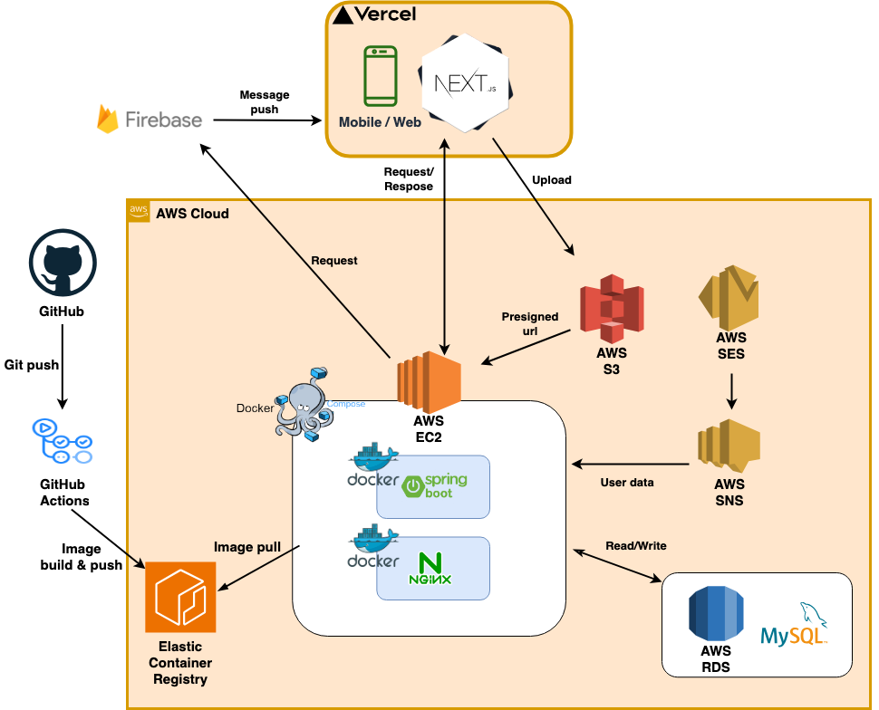

# 🏋️‍♂️ 피트니스 예약 관리 시스템 (Fit-link)

**트레이너와 회원의 반복적이고 복잡한 예약 과정을 자동화하고, 효율적으로 관리할 수 있도록 설계된 예약 플랫폼**

 

---

## 📖 목차

1. [프로젝트 개요](#1-프로젝트-개요)
2. [프로젝트 동기](#2-프로젝트-동기)
3. [기술 스택](#3-기술-스택)
4. [아키텍처](#4-아키텍처)
5. [주요 기능](#5-주요-기능)
6. [기능 명세 및 시퀀스 다이어그램](#6-기능-명세-및-시퀀스-다이어그램)
7. [API 명세](#7-api-명세서)
8. [트러블슈팅](#8-트러블슈팅)
9. [개발 중 고민과 해결](#9-개발-중-고민과-해결)
10. [배포 링크 및 스크린샷](#10-배포-링크-및-스크린샷)
11. [향후 계획](#11-향후-계획)
12. [팀원 정보](#12-팀원-정보)

---
## 1. 프로젝트 개요
 

- **프로젝트명**: 피트니스 예약 관리 시스템
- **기간**: 2024.12 ~ 
- **목적**: 헬스장 내부의 PT 예약 및 트레이너 관리 업무를 디지털화
- **대상 사용자**: 트레이너, 회원

 

---
## 2. 프로젝트 동기
 

보통 PT 회원들은 매번 PT 수업이 끝난 뒤 구두로 다음 수업을 잡습니다. 이때 회원 입장에서는
 **어느 날짜, 어느 시간에 수업이 비어 있는지 알 수 없어 매우 불편** 합니다.
트레이너 입장에서도 회원과 수업 날짜를 잡기 위해
**매번 수업 시간표를 확인해야 하는 번거로움** 이 있습니다.

이렇게 트레이너와 회원 간의 번거로운 문제를 해결하기 위해 예약 서비스를 만들려고 합니다.
이를 통해 회원은 언제 어디서든   **실시간으로**  예약 가능한 시간대를 확인하여 예약할 수 있고,
트레이너 역시 수업 일정 관리의 부담을 줄일 수 있도록 자동화된 시스템을 제공합니다.

 

> 우리가 만들 서비스는 네이버 예약처럼 누구나 예약할 수 있는 시스템이 아니고,
>  **트레이너와 PT를 받는 회원만 예약할 수 있는 서비스입니다.** 

 

---
## 3. 기술 스택
 

### **Backend**

- **Language**: Java 17
- **Framework**: Spring Boot 3.4.1
- **Database**: MySQL 8.xx
- **ORM**: Spring Data JPA + QueryDSL
- **Authentication**: OAuth2 + JWT
- **Push Notification**: Firebase Cloud Messaging (FCM)

### **Infra & DevOps**

- **CI/CD**: GitHub Actions + Docker + EC2
- **Middleware:** AWS SNS, AWS S3, AWS RDS(8.xx)
- **Monitoring**: (예정) Spring Actuator, Grafana

---
## 4. 아키텍처

---
## 5. 주요 기능
 

| **기능** | **설명** |
| --- | --- |
| **예약 등록** | 회원이 세션을 선택해 예약 요청 |
| **고정 예약** | 세션이 모두 소진될 때까지 동일 요일, 시간으로 반복 예약 자동 생성 |
| **예약 취소** | 취소 사유 및 승인 절차 포함 |
| **예약 변경 요청** | 기존 예약에 대한 시간 변경 요청 기능 |
| **휴무 설정** | 트레이너가 특정 날짜를 휴무로 설정하면 해당일 예약 불가 처리 |
| **알림 기능** | 예약 확정, 변경, 취소 시 회원/트레이너에게 실시간 푸시 알림 전송 |
| **운영 시간 관리** | 트레이너가 요일별 예약 가능 시간 설정 가능 |
| **선호 시간 설정** | 회원이 운동하기 좋은 선호 시간 등록 가능 |

---
## 6. 기능 명세 및 시퀀스 다이어그램
 

### 트레이너 기능 명세

[트레이너_기능_명세](https://docs.google.com/spreadsheets/d/1Cix12FeJTmoz3gzzo4VPtI6R5A02McWfG6qDqzWzJbE/edit?gid=0#gid=0)

### 회원 기능 명세
[회원_기능_명세](https://docs.google.com/spreadsheets/d/1LKWKU2DC2aeEGF3aiv0lQzqPqj3zJaA_4RqLQuoKgOM/edit?usp=sharing)

### 시퀀스 다이어그램 1

### 시퀀스 다이어그램 2

### 시퀀스 다이어그램 3

### 시퀀스 다이어그램 4

### 시퀀스 다이어그램 5

---
## 7. API 명세서
 

### **API 명세서**
[FitLink API Docs](https://documenter.getpostman.com/view/19533799/2sAYX6qhbN#43e2212b-4474-433f-81a1-48fc9f4be977)

---
## 8. 트러블슈팅
 

트러블슈팅 관련된 내용은 [여기](docs/troubleshooting.md)을 확인해주세요.

---
## 9. 개발 중 고민과 해결
 

프로젝트를 진행하면서 했던 고민과 해결 과정은 [여기](docs/dev-log.md)를 참고해주세요.

---
## 10. 배포 링크 및 스크린샷
 

### 프론트엔드
- https://fit-link-user.vercel.app
- https://fit-link-trainer.vercel.app

---
## 11. 향후 계획
 

- **헬스 커뮤니티**
- **채팅(트레이너 ↔ 회원간의 소통)**
- **인바디 연동**
- **결제(PT 수업 결제)**
- **회원별 PT 일지 관리**

---
## 12. 팀원 정보
 

| **Name** | **Position** | **E-Mail** | **GitHub** |
| --- | --- | --- | --- |
| 최익 | FE | [ci980704@gmail.com](mailto:ci980704@gmail.com) | https://github.com/choi-ik |
| 최용재 | FE | [yongjae.choi20@gmail.com](mailto:yongjae.choi20@gmail.com) | https://github.com/yjc2021 |
| 마승현 | Mobile | [tpdlqj0514@gmail.com](mailto:tpdlqj0514@gmail.com) | https://github.com/MaSeungHyun |
| 박경태 | BE | [smileboy0014@gmail.com](mailto:smileboy0014@gmail.com) | https://github.com/smileboy0014 |
| 이현규 | BE | [azdlgusrb@naver.com](mailto:azdlgusrb@naver.com) | https://github.com/wken5577 |
| 권세영 | Designer | [tpdud9023@naver.com](https://admin.atlassian.com/o/7cc75f09-da75-490f-a896-40361343b5db/users/712020:27e13b26-4449-4f91-acb0-5717a7a8c9ae) |  |

