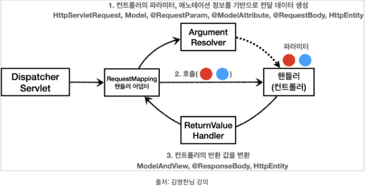
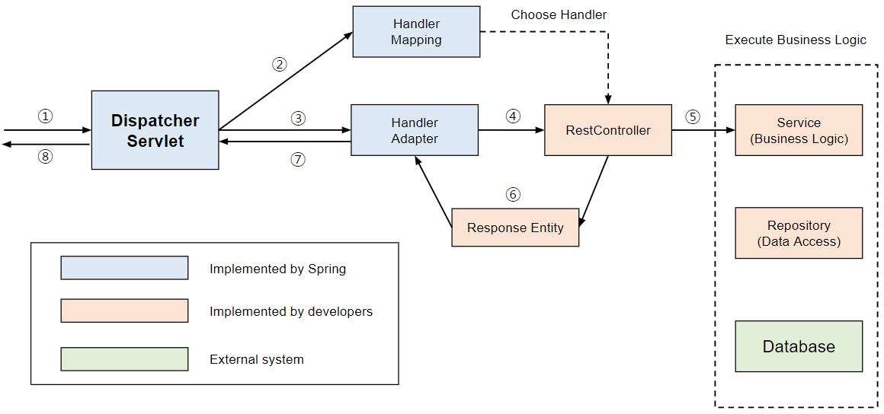
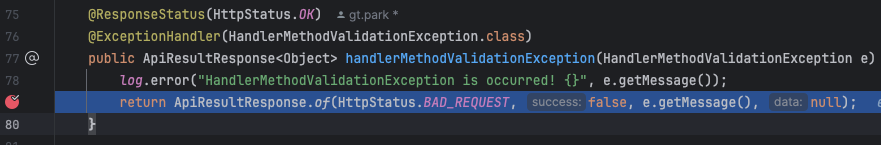
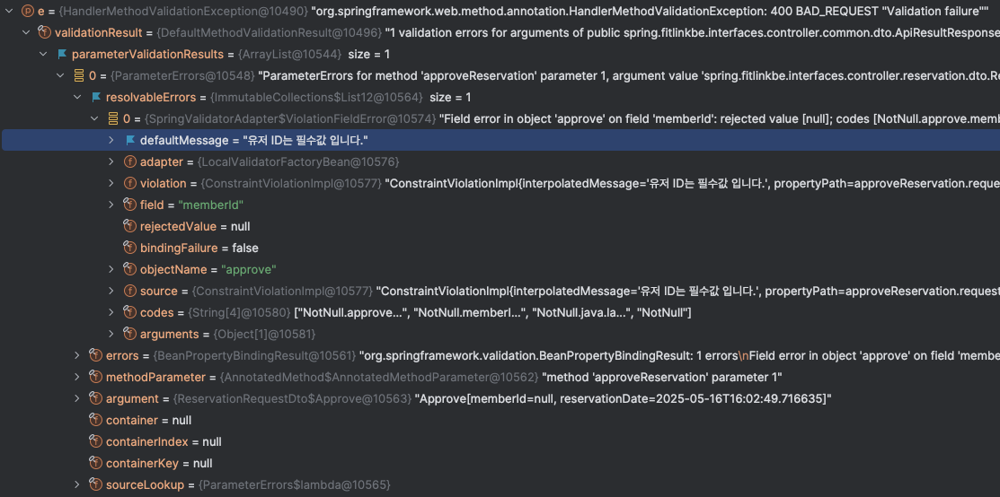

# 🏋️‍♂️ 피트니스 예약 관리 시스템 (Fit-link)

**트레이너와 회원의 반복적이고 복잡한 예약 과정을 자동화하고, 효율적으로 관리할 수 있도록 설계된 예약 플랫폼**

<br />

---

## 📖 목차

1. [프로젝트 개요](#1-프로젝트-개요)
2. [프로젝트 동기](#2-프로젝트-동기)
3. [기술 스택](#3-기술-스택)
4. [아키텍처](#4-아키텍처)
5. [주요 기능](#5-주요-기능)
6. [기능 명세 및 시퀀스 다이어그램](#6-기능-명세-및-시퀀스-다이어그램)
7. [API 명세](#7-api-명세서)
8. [트러블슈팅](#8-트러블슈팅)
9. [개발 중 고민과 해결](#9-개발-중-고민과-해결)
10. [배포 링크 및 스크린샷](#10-배포-링크-및-스크린샷)
11. [향후 계획](#11-향후-계획)
12. [팀원 정보](#12-팀원-정보)

---
## 1. 프로젝트 개요
<br />

- **프로젝트명**: 피트니스 예약 관리 시스템
- **기간**: 2024.12 ~ 
- **목적**: 헬스장 내부의 PT 예약 및 트레이너 관리 업무를 디지털화
- **대상 사용자**: 트레이너, 회원

<br />

---
## 2. 프로젝트 동기
<br />

보통 PT 회원들은 매번 PT 수업이 끝난 뒤 구두로 다음 수업을 잡습니다. 이때 회원 입장에서는
<span style="color:#cd8741"> **어느 날짜, 어느 시간에 수업이 비어 있는지 알 수 없어 매우 불편** </span>합니다.
트레이너 입장에서도 회원과 수업 날짜를 잡기 위해
<span style="color:#cd8741">**매번 수업 시간표를 확인해야 하는 번거로움**</span> 이 있습니다.

이렇게 트레이너와 회원 간의 번거로운 문제를 해결하기 위해 예약 서비스를 만들려고 합니다.
이를 통해 회원은 언제 어디서든 <span style="color:#cd8741">  **실시간으로** </span> 예약 가능한 시간대를 확인하여 예약할 수 있고,
트레이너 역시 수업 일정 관리의 부담을 줄일 수 있도록 자동화된 시스템을 제공합니다.

<br />

> 우리가 만들 서비스는 네이버 예약처럼 누구나 예약할 수 있는 시스템이 아니고,
> <span style="color:#cd8741"> **트레이너와 PT를 받는 회원만 예약할 수 있는 서비스입니다.** </span>

<br />

---
## 3. 기술 스택
<br />

### **Backend**

- **Language**: Java 17
- **Framework**: Spring Boot 3.4.1
- **Database**: MySQL 8.xx
- **ORM**: Spring Data JPA + QueryDSL
- **Authentication**: OAuth2 + JWT
- **Push Notification**: Firebase Cloud Messaging (FCM)

### **Infra & DevOps**

- **CI/CD**: GitHub Actions + Docker + EC2
- **Middleware:** AWS SNS, AWS S3, AWS RDS(8.xx)
- **Monitoring**: (예정) Spring Actuator, Grafana

---
## 4. 아키텍처


---
## 5. 주요 기능
<br />

| **기능** | **설명** |
| --- | --- |
| **예약 등록** | 회원이 세션을 선택해 예약 요청 |
| **고정 예약** | 세션이 모두 소진될 때까지 동일 요일, 시간으로 반복 예약 자동 생성 |
| **예약 취소** | 취소 사유 및 승인 절차 포함 |
| **예약 변경 요청** | 기존 예약에 대한 시간 변경 요청 기능 |
| **휴무 설정** | 트레이너가 특정 날짜를 휴무로 설정하면 해당일 예약 불가 처리 |
| **알림 기능** | 예약 확정, 변경, 취소 시 회원/트레이너에게 실시간 푸시 알림 전송 |
| **운영 시간 관리** | 트레이너가 요일별 예약 가능 시간 설정 가능 |
| **선호 시간 설정** | 회원이 운동하기 좋은 선호 시간 등록 가능 |

---
## 6. 기능 명세 및 시퀀스 다이어그램
<br />

### 트레이너 기능 명세

[트레이너_기능_명세](https://docs.google.com/spreadsheets/d/1Cix12FeJTmoz3gzzo4VPtI6R5A02McWfG6qDqzWzJbE/edit?gid=0#gid=0)

### 회원 기능 명세
[회원_기능_명세](https://docs.google.com/spreadsheets/d/1LKWKU2DC2aeEGF3aiv0lQzqPqj3zJaA_4RqLQuoKgOM/edit?usp=sharing)

### 시퀀스 다이어그램 1

### 시퀀스 다이어그램 2

### 시퀀스 다이어그램 3

### 시퀀스 다이어그램 4

### 시퀀스 다이어그램 5


---
## 7. API 명세서
<br />

### **API 명세서**
[FitLink API Docs](https://documenter.getpostman.com/view/19533799/2sAYX6qhbN#43e2212b-4474-433f-81a1-48fc9f4be977)

---
## 8. 트러블슈팅
<br />

## 8-1. 알림 발송 트랜잭션 분리

### 8-1-1. 문제

기존에 알림 발송 로직은 다음과 같이 구성되어 있었습니다.

```java
@Service
@Transactional(readOnly = true)
@RequiredArgsConstructor
public class NotificationService {
  private final NotificationStrategyHandler strategyHandler;
  ...

  @Transactional
  public <T extends NotificationRequest> void sendNotification(T request) {
      // 1. DB 저장
      Notification notification = strategyHandler.handle(request);
      notificationRepository.save(notification);
      // 2. push 알림 전송
      pushNotificationClient.pushNotification(token, title, content);
  }
}
```

이 로직은 정상적으로 동작하지만 다음과 같은 문제점이 있습니다.

- 비즈니스 계층과 인프라 계층의 시스템이 **강하게 결합되어 있습니다.**

따라서 시스템의 복잡도가 올라갈 뿐만 아니라 만약에 push 알림 전송 도중에 에러가 발생한다면 위에 알림 저장 로직도 **롤백이 되게 됩니다.**

하나의 트랜잭션 내에서 ‘모두 성공하거나, 모두 실패해야한다.’ 라는 점에서는 맞는 로직이지만, 외부 시스템에 의해서 DB 로직이 실패하는건 **핵심로직이 부가로직에 오염된 것처럼 보였습니다.**

### 8-1-2. 원인

생각해보면, 위 로직은 **단일책임원칙을** 위배하는 것처럼 보입니다.

**“하나의 모듈은 하나의 책임만 가져아 한다.”**

위 로직을 살펴보면

- DB에 알림 정보 저장 **(핵심 로직)**
- psuh 알림 전송 **(부가 로직)**

두가지 **책임을** 가지고 있습니다.

따라서 로직을 분리할 필요가 있어 보입니다.

### 8-1-3. 해결방법

**EDA**를 도입하여 위 문제를 해결하려고 하였습니다.

### **EDA란?**

- **Event-Driven Architecture (이벤트 기반 아키텍처)**
- 시스템 구성 요소들이 **이벤트(event)** 를 중심으로 **생성 → 전달 → 처리**되는 구조
- 이벤트: 시스템 내에서 발생한 어떤 **상태 변화나 행동 (예: 주문 완료, 결제 성공)**

이것을 도입하면 시스템간의 복잡도를 낮춰 **느슨한 결합**과 **확장성**에 유리하게 됩니다.

그리고 EDA를 도입하면 이벤트 단위로 책임이 분산되므로, 자연스럽게 관심사의 분리가 가능하게 됩니다.

스프링에서 지원하는 `ApplicationEventPublisher` 와 `EventListener` 를 활용하면 충분히 이벤트 드리븐하게 위 상황을 해결할 수 있을 것 같습니다.

### 8-1-4. 적용

바뀐 로직을 보면

```java
@Service
@Transactional(readOnly = true)
@RequiredArgsConstructor
public class NotificationService {
    private final NotificationRepository notificationRepository;
    private final NotificationStrategyHandler strategyHandler;
    private final PushNotificationClient pushNotificationClient;
    private final ApplicationEventPublisher publisher;

   ...

  @Transactional
  public <T extends NotificationRequest> void sendNotification(T request) {
      // 1. DB 저장
      Notification notification = strategyHandler.handle(request);
      notificationRepository.save(notification);
      // 2. push 알림 전송 이벤트로 전달
      publisher.publishEvent(PushEvent.builder()
              .pushToken(request.getPushToken())
              .name(notification.getName())
              .content(notification.getContent())
              .build());
  }
    
   public void pushNotification(String token, String title, String content) {
      pushNotificationClient.pushNotification(token, title, content);
  }
 ... 
}
```

이벤트가 발행되면, 이벤트를 수신하는 곳에서 그 이벤트를 처리합니다.

```java
@Component
@RequiredArgsConstructor
public class NotificationEventListener {

    private final NotificationService notificationService;

    @Async
    @TransactionalEventListener(phase = TransactionPhase.AFTER_COMMIT)
    public void onPushEvent(PushEvent event) {
        notificationService.pushNotification(event.pushToken(), event.name(), event.content());
    }
}
```

여기서 `@TransactionalEventListener(phase = TransactionPhase.AFTER_COMMIT)` 이 옵션을 통해, **DB 로직이 commit이 된 후**, 이벤트를 호출하게 됩니다.

따라서 `pushNotificationClient.pushNotification(token, title, content);` 이 로직이 실패하더라도, 핵심 로직은 보호 받게 됩니다.

다만, 알림 전송이 실패하는 경우, **retry 로직으로 알림 전송을 보장해주는 로직을 보완해야할 것 같습니다.**

## 8-2. @Valid가 동작하지 않음
<br />

### 8-2-1. 문제

테스트코드를 작성 후, 테스트를 하던 중 이상한 점을 발견하였습니다.

```java
@RoleCheck(allowedRoles = {UserRole.TRAINER})
@PostMapping("/{reservationId}/approve")
public ApiResultResponse<ReservationResponseDto.Success> approveReservation(@PathVariable("reservationId")
                                                                            @NotNull(message = "예약 ID는 필수값입니다.")
                                                                            Long reservationId,
                                                                            @RequestBody @Valid
                                                                            ReservationRequestDto.Approve
                                                                                    request,
                                                                            @Login SecurityUser user
) {
    Reservation result = reservationFacade.approveReservation(request.toCriteria(reservationId), user);

    return ApiResultResponse.ok(ReservationResponseDto.Success.of(result));

}
```

```java
public class ReservationRequestDto {
	...
	
	@Builder(toBuilder = true)
	public record Approve(@NotNull(message = "유저 ID는 필수값 입니다.") Long memberId,
	                      @NotNull(message = "요청 날짜는 비어있을 수 없습니다.")
	                      @FutureOrPresent(message = "현재 날짜보다 이전일 수 없습니다.")
	                      LocalDateTime reservationDate) {
	    public ReservationCriteria.Approve toCriteria(Long reservationId) {
	
	        return ReservationCriteria.Approve.builder()
	                .reservationId(reservationId)
	                .memberId(memberId)
	                .reservationDate(reservationDate)
	                .build();
	    }
	}
	
 ...
}

```

예외는 공통으로 `@RestControllerAdvice` 를 작성하여 처리하였습니다.

```java
@RestControllerAdvice
@Slf4j(topic = "ExceptionLogger")
public class ApiControllerAdvice {

    @ResponseStatus(HttpStatus.OK)
    @ExceptionHandler(CustomException.class)
    public ApiResultResponse<Object> handlerCustomException(CustomException e) {
        log.error("CustomException is occurred! {}", e.getMessage());
        return ApiResultResponse.of(HttpStatus.valueOf(e.getStatus()), false, e.getMessage(), null);
    }
    
    @ResponseStatus(HttpStatus.OK)
    @ExceptionHandler(HandlerMethodValidationException.class)
    public ApiResultResponse<Object> handlerMethodValidationException(HandlerMethodValidationException e) {
        log.error("HandlerMethodValidationException is occurred! {}", e.getMessage());
        return ApiResultResponse.of(HttpStatus.BAD_REQUEST, false, e.getMessage(), null);
    }
    ...
    
}
```

```java
@WebMvcTest(ReservationController.class)
class ReservationControllerTest {

    @Autowired
    private MockMvc mockMvc;

    @Autowired
    private ObjectMapper objectMapper;

    @MockitoBean
    private ReservationFacade reservationFacade;

    @MockitoBean
    private AuthTokenProvider authTokenProvider;

    @MockitoBean
    private PersonalDetailRepository personalDetailRepository;

    @MockitoBean
    private LoginMemberArgumentResolver loginMemberArgumentResolver;

...

@Nested
@DisplayName("예약 승인 Controller TEST")
class ApproveReservationControllerTest {
    
    ...

    @Test
    @DisplayName("트레이너의 예약 실패 - 멤버 ID 부재")
    void approveReservationWithNoMemberId() throws Exception {
        //given
        ReservationRequestDto.Approve request = ReservationRequestDto.Approve.builder()
                .reservationDate(LocalDateTime.now().plusSeconds(2))
                .build();

        Long reservationId = 1L;

        Reservation result = Reservation.builder()
                .reservationId(1L)
                .status(RESERVATION_APPROVED)
                .build();

        PersonalDetail personalDetail = PersonalDetail.builder()
                .personalDetailId(1L)
                .name("멤버1")
                .memberId(1L)
                .trainerId(null)
                .build();

        SecurityUser user = new SecurityUser(personalDetail);

        String accessToken = getAccessToken(personalDetail);

        when(reservationFacade.approveReservation(any(ReservationCriteria.Approve.class),
                any(SecurityUser.class))).thenReturn(result);

        //when & then
        mockMvc.perform(post("/v1/reservations/%s/approve".formatted(reservationId))
                        .header("Authorization", "Bearer " + accessToken)
                        .with(oauth2Login().oauth2User(user))
                        .with(csrf())
                        .content(objectMapper.writeValueAsString(request))
                        .contentType(MediaType.APPLICATION_JSON))
                .andDo(print())
                .andExpect(status().isOk())
                .andExpect(jsonPath("$.status").value(400))
                .andExpect(jsonPath("$.success").value(false))
                .andExpect(jsonPath("$.msg").value("유저 ID는 필수값 입니다."))
                .andExpect(jsonPath("$.data").isEmpty());
      }
  }
  
  ...
}

```

위의 테스트 코드를 돌려보면 다음과 같은 결과가 나옵니다.

```java
Resolved Exception:
             Type = org.springframework.web.method.annotation.HandlerMethodValidationException
...

JSON path "$.msg"
Expected :유저 ID는 필수값 입니다.
Actual   :400 BAD_REQUEST "Validation failure"
```

제가 기대하는 건 `‘유저 ID는 필수값 입니다.’` 라는 메세지인데 `400 BAD_REQUEST "Validation failure"` 가 실제로 출력이 되었습니다.

로그를 보면 `HandlerMethodValidationException` 가 발생하는걸 알 수 있고, `@RestControllerAdvice` 에서 해당 `Exception`을 잡아서 처리를 해줬습니다.

`@Valid` 을 통해 `@RequestBody` 를 유효성 검증을 했는데, 왜 원하는 메세지가 출력이 되질 않는지 이해가 되지 않았습니다.

### 8-2-2. 원인

### **기존의 Spring의 @Valid 어노테이션이 동작하는 과정**




스프링에서 Dispatcher Servlet은 **RequestMapping 핸들러 어댑터**를 통해 클라이언트로부터 들어오는 요청을 처리합니다. 유효성 검증을 위한 Validator를 미리 등록해두고, 요청이 들어왔을 때 **ArgumentResolver**를 호출해서 `@RequestParam, @RequestBody, @ModelAttribute` 등 들어오는 모든 필드를 검증하게 됩니다.

중요한 점은 `@RequestParam, @RequestBody`에 대한 검증을 SpringBoot3.2 이전 버전에서는 ArgumentResolver 하나가 **모두 위임 받는다는 것입니다**.

따라서 `@NotNull, @Blank, @Size` 와 같은 Constraint 어노테이션을 parameter 혹은 body에 붙여주기만 하면 필드 유효성 검증이 이루어졌습니다.

### **SpringBoot3 버전에서 @RequestBody에 대한 @Vaild 유효성 검증**

스프링 부트3(엄밀히는 스프링 6.1)부터 Spring MVC와 WebFlux에서 유효성 검사를 위한`@Constraint` 관련 애노테이션을 **기본적으로 지원하도록 개선되었습니다.**



기존에 처리 과정과 동일하게 `ArgumentResolver`들이 모두 동작하고, 컨트롤러의 메서드 호출이 준비되었을 때 유효성 검사가 진행됩니다. 스프링은 이를 **`MethodValidator`** 라고 부릅니다.

### 새로운 유효성 검사 기능(MethodValidator) 사용법

스프링의 `MethodValidator` 관련 기능을 활용하기 위해서는 다음의 조건들이 충족되면 됩니다.

1. 컨트롤러에 @Validated를 통한 AOP 기반 검증이 존재하지 않음
2. LocalValidatorFactoryBean와 같은 jakarta.validation.Validator 타입의 빈이 등록됨
3. 메서드 파라미터에 유효성 검증 애노테이션이 붙어있음

따라서 스프링 부트 3.2 이상 이라면  `@Valid` 또는 `@Validated`를 붙여줄 필요 없이 기본적인 유효성 검증이 동작하게 됩니다.

이때부터 `HandlerMethodValidationException` 가 추가가 되었습니다.

이 사실은 스프링 공식 문서에도 확인해 볼 수 있습니다.

> Spring MVC has built-in [validation](https://docs.spring.io/spring-framework/reference/core/validation/validator.html) for `@RequestMapping` methods, including [Java Bean Validation](https://docs.spring.io/spring-framework/reference/core/validation/beanvalidation.html). Validation may be applied at one of two levels:
>
>
> 1. [@ModelAttribute](https://docs.spring.io/spring-framework/reference/web/webmvc/mvc-controller/ann-methods/modelattrib-method-args.html), [@RequestBody](https://docs.spring.io/spring-framework/reference/web/webmvc/mvc-controller/ann-methods/requestbody.html), and [@RequestPart](https://docs.spring.io/spring-framework/reference/web/webmvc/mvc-controller/ann-methods/multipart-forms.html) argument resolvers validate a method argument individually if the method parameter is annotated with Jakarta `@Valid` or Spring’s `@Validated`, *AND* there is no `Errors` or `BindingResult` parameter immediately after, *AND* method validation is not needed (to be discussed next). The exception raised in this case is `MethodArgumentNotValidException`.
> 2. When `@Constraint` annotations such as `@Min`, `@NotBlank` and others are declared directly on method parameters, or on the method (for the return value), then method validation must be applied, and that supersedes validation at the method argument level because method validation covers both method parameter constraints and nested constraints via `@Valid`. The exception raised in this case is **`HandlerMethodValidationException`**.
>
<br />

`HandlerMethodValidationException` 의 유효성 검증 과정을 자세히 살펴보면

```java
@SuppressWarnings("serial")
public class HandlerMethodValidationException extends ResponseStatusException implements MethodValidationResult {

	private final MethodValidationResult validationResult;

	private final Predicate<MethodParameter> modelAttributePredicate;

	private final Predicate<MethodParameter> requestParamPredicate;

	public HandlerMethodValidationException(MethodValidationResult validationResult) {
		this(validationResult,
				param -> param.hasParameterAnnotation(ModelAttribute.class),
				param -> param.hasParameterAnnotation(RequestParam.class));
	}
```

`HandlerMethodValidationException`의 생성자를 보면 `@ModelAttribute`와 `@RequestParam`에 대한 유효성 검증 처리만을 전달하고 있습니다.

반면, `@RequestBody`나 `@PathVariable` 등에 대한 유효성 검증은 **제외되어 있습니다.**

### 8-2-3. 해결방법

`HandlerMethodValidationException` 에서 더이상 `@RequestBody` 에 대해서 유효성 검증을 담당하고 있지 않기 때문에 직접 메세지를 핸들링 해주기로 하였습니다.

<br />
이 방식은 스프링 공식문서에서도 권장하는 방식입니다.

> **For further custom handling of method validation errors, you can extend `ResponseEntityExceptionHandler` or use an `@ExceptionHandler` method in a controller or in a `@ControllerAdvice`, and handle `HandlerMethodValidationException` directly.** The exception contains a list of `ParameterValidationResult`s that group validation errors by method parameter. You can either iterate over those, or provide a visitor with callback methods by controller method parameter type:
>

<br />

그래서 디버깅을 통해 위 내용이 사실인지 확인해 보기로 하였습니다.

테스트 코드를 디버깅 모드로 돌려서 breakPoint를 에러를 핸들링 하는곳에 잡아두고,



디버깅에 찍히는 값을 확인해 보면



`ParameterValidationResults -> getResolvableErrors -> getDefaultMessage` 에 들어가보면 제가 설정한 메세지를 확인할 수 있었습니다.

### 8-2-4. 적용

눈으로 확인했으니, 다음 예외가 발생했을 때 제 메세지를 반환해주는 작업만 해주면 될 것 같습니다.

```java
public class MessageConvertUtils {

    /**
     * DTO에서 값을 검증할 때 메시지를 설정했을 경우 그 메시지만 나오게 변환
     *
     * @return 내가 설정한 메시지
     */
    public static String getErrorCustomMessage(Exception e) {

        if (e instanceof HandlerMethodValidationException exception) {
            return exception.getParameterValidationResults().stream()  // getValidationResults() 사용
                    .map(ParameterValidationResult::getResolvableErrors)
                    .flatMap(Collection::stream)
                    .map(MessageSourceResolvable::getDefaultMessage)
                    .collect(Collectors.collectingAndThen(Collectors.joining(", "),
                            msg -> msg.isEmpty() ? "보내는 파라미터를 다시 확인해주세요." : msg));
        }
        
        return e.getMessage();
    }
}

```

다음 유틸 함수를 적용하면,

```java
@RestControllerAdvice
@Slf4j(topic = "ExceptionLogger")
public class ApiControllerAdvice {

    @ResponseStatus(HttpStatus.OK)
    @ExceptionHandler(CustomException.class)
    public ApiResultResponse<Object> handlerCustomException(CustomException e) {
        log.error("CustomException is occurred! {}", e.getMessage());
        return ApiResultResponse.of(HttpStatus.valueOf(e.getStatus()), false, e.getMessage(), null);
    }
    
    @ResponseStatus(HttpStatus.OK)
    @ExceptionHandler(HandlerMethodValidationException.class)
    public ApiResultResponse<Object> handlerMethodValidationException(HandlerMethodValidationException e) {
        log.error("HandlerMethodValidationException is occurred! {}", e.getMessage());
        return ApiResultResponse.of(HttpStatus.BAD_REQUEST, false, getErrorCustomMessage(e), null);
    }
    ...
    
}
```

그리고 다시 테스트 코드를 돌려보면 결과는

```java
MockHttpServletResponse:
           Status = 200
    Error message = null
          Headers = [Content-Type:"application/json", X-Content-Type-Options:"nosniff", X-XSS-Protection:"0", Cache-Control:"no-cache, no-store, max-age=0, must-revalidate", Pragma:"no-cache", Expires:"0", X-Frame-Options:"DENY"]
     Content type = application/json
             Body = {"status":400,"success":false,"msg":"유저 ID는 필수값 입니다.","data":null}
    Forwarded URL = null
   Redirected URL = null
          Cookies = []
```

설정한 메세지가 정상적으로 출력되는 것을 볼 수 있습니다.


---
## 9. 개발 중 고민과 해결
<br />

## 9-1. 고정 예약 로직


### 9-1-1. 매일 스케줄러를 실행

처음 고정 예약을 기능 명세로 봤을 때 들었던 생각은, **‘매일 스케줄러가 자정에 돌아서, 당일에 고정 예약으로 잡혀 있는 예약들을 선별하여, 일주일 뒤에 예약을 잡아주면 되겠다.’** 이였습니다.

그래서 다음과 같이 스케줄러를 설정하고,

```java
@Component
@RequiredArgsConstructor
@Slf4j
public class FixedReservationScheduler { //

    private final ReservationFacade reservationFacade;

    /**
     * 매일 정각마다 고정 예약 확인하고, 예약 실행 (일주일 뒤에 고정 예약 함)
     */
    @Scheduled(cron = "0 0 0 * * *") // 매일 00:00:00에 실행
    public void fixedReserveSession() {
        reservationFacade.checkFixedReserveSession();
    }
}
```

기능을 구현하였습니다.

```java
@Component
@RequiredArgsConstructor
public class ReservationFacade {

...

	@Transactional
	public void checkFixedReserveSession() {
	    // 고정 예약 상태의 예약 조회
	    List<Reservation> fixedReservations = reservationService.getFixedReservations();
	
	    // 일주일 뒤에 시간으로 예약 도메인 생성
	    List<Reservation> newReservations = fixedReservations.stream()
	            .map(Reservation::toFixedDomain)
	            .toList();
	    // 일주일 뒤에 시간에 예약이 있다면(예약 대기 포함) 취소 절차 진행
	    newReservations.forEach((r) -> {
	        List<Reservation> getThatTimeReservations = reservationService.getReservationThatTimes(
	                ReservationCommand.GetReservationThatTimes.builder()
	                        .trainerId(r.getTrainer().getTrainerId())
	                        .date(r.getReservationDates())
	                        .build());
	
	        cancelExistingReservations(getThatTimeReservations, "트레이너의 고정 예약으로 인해 예약이 취소되었습니다.");
	    });
	    // 고정 예약 진행
	    reservationService.fixedReserveSessions(newReservations);
	}
	
	private void cancelExistingReservations(List<Reservation> reservations, String cancelMsg) {
	    if (!reservations.isEmpty()) {
	        reservations.forEach(Reservation::checkPossibleReserveStatus);
	        // 만약 예약이 있다면, 그 예약들 모두 강제로 취소
	        reservationService.cancelReservations(reservations, cancelMsg);
	        // 취소했다면, 취소됐다는 알람 전송
	        reservations.forEach(r -> notificationService.sendCancelReservationNotification(r.getReservationId(),
	                memberService.getMemberDetail(r.getMember().getMemberId()), RESERVATION_REFUSE));
	    }
	}
...
}

```

그런데 기능을 구현하고 보니 문제점이 보였습니다.

- 일주일 뒤에 그 시간에 예약이 있다면 그 예약을 취소시켜야할까?
    - 예약의 우선 순위가 고정예약이 가장 높을까?
- 만약 그날에 고정 예약이 2개가 있는데, 스케줄러가 돌다가 에러가 나면 둘 다 실패해버리네?
    - 각각의 고정 예약은 독립적으로 예약이 되어야 하지 않을까?
    - 만약 에러가 발생하면 다시 시도하는 로직이 있어야하지 않을까?

### 9-1-2. SQS로 로직 이관

위와 같은 고민 때문에 다음과 같이 문제점을 해결하기로 하였습니다.

- 일주일 뒤에 그 시간에 예약이 있다면 그 예약을 취소시켜야할까?

→ **확정된 예약이 아닌 대기 중인 예약이 있다면** 거절시키고, 그 나머지 경우에는 고정 예약을 진행시키자!

- 만약 그날에 고정 예약이 2개가 있는데, 스케줄러가 돌다가 에러가 나면 둘 다 실패해버리네?

→ 각각의 고정 예약을 하나의 테스크로 인식하고, **Queue**를 통해서 고정 예약을 진행시키자!

Queue 기반으로 고정예약 작업을 선택한 이유는 다음과 같습니다.

1. **실패 분리**
- 개별 작업으로 분리되기 때문에 **하나 실패해도 전체 작업엔 영향이 없습니다.**
- 실패한 작업만 따로 retry하거나 alert 줄 수 있습니다.
2. **확장성**
- Queue 기반 구조는 **작업이 많아져도 분산 처리가 가능합니다.**
    - 메시지 브로커 (예: RabbitMQ, SQS, Kafka)
3. **비동기 처리**
- 사용자 입장에서 **즉각적인 반응** 필요 없이 백그라운드에서 진행이 가능합니다.

스프링 내부적으로 Queue구조를 메모리에 등록해서 사용할 수도 있지만, 그럼 또 다음과 같은 문제들이 고려되었습니다.

1.  **서버가 재시작되면 큐가 초기화됩니다.**
- 고정 예약 작업이 queue에 들어있다가, 서버가 다운되면 queue정보가 사라지게 됩니다.
    - 즉, **비지속성(non-durable)** 구조를 가지게 됩니다.
2. **분산 환경에서 동기화가 안 됩니다.**
- 만약 서버 2대 이상인 분산 환경이라면 인스턴스 마다 queue가 따로 있게 되기 때문에 **예약이 중복되거나 누락될 수 있습니다.**
3. **모니터링/재시도/DLQ 등 고급 기능이 없습니다.**
- 재시도 로직, delay, backoff 같은 걸 직접 구현해야 합니다.

따라서 외부 미들웨어로 동작하는 Queue를 고려하게 되었습니다.

- Kafka
- RabbitMQ
- AWS SQS

Kafka는 스택 자체가 무겁고, 빠르게 스트리밍한 데이터를 처리하는 용도가 지금 아니기 때문에 제외하기로 했습니다.

마지막으로 남은 RabbitMQ와 AWS SQS를 비교해보면

| **기준** | **RabbitMQ** | **SQS (Amazon Simple Queue Service)** |
| --- | --- | --- |
| 운영 방식 | 직접 설치 / 관리 필요 (EC2나 ECS 위에 올려야 함) | Fully managed, AWS에서 다 해줌 |
| 복잡도 | 더 유연하지만 설정과 운영 부담 있음 | 간단하게 시작 가능, 운영 거의 없음 |
| 기능 | 고급 라우팅 (topic, fanout 등), retry 설정도 큼 | 기본적인 FIFO, DLQ(Dead Letter Queue)만 있음 |
| Retry | Consumer에서 직접 재시도 구현해야 함 | DLQ + Visibility Timeout으로 재시도 유도 가능 |
| Outbox 패턴 연계 | 직접 연동 | AWS DynamoDB Streams, EventBridge랑 연계 쉬움 |

지금 상황에서는 **정말 간단한 Queue기능** 역할만 해주는 스택만 있으면 됩니다.

따라서 우리 서버는 AWS 위에 올라가서 운영이 되기 때문에 좀 더 AWS에 친화적이면서 운영이 쉬운 SQS 최종적으로 사용하기로 결정했습니다.

추가적으로 queue 메세지 발행이 실패하는 것을 방지하기 위해 **Transactional Outbox Pattern**를 적용하였습니다.

### **Transactional Outbox Pattern?**

- 도메인 로직이 성공적으로 수행되었다면, 이에 해당하는 이벤트 메세지를 `Outbox Table` 이라는 별도의 테이블에 저장하여 함께 Commit 합니다.
- 동일한 트랜잭션 내에서 이벤트 발행을 위한 Outbox 데이터 적재까지 진행해 이벤트 발행을 보장합니다.
- 이벤트 발행 상태 또한 Outbox 데이터에 존재하므로, 배치 프로세스 등을 이용해 미발행된 데이터에 대한 Fallback 처리가 용이합니다.

```java
@Component
@RequiredArgsConstructor
@Slf4j
public class ReservationScheduler { //

    private final ReservationFacade reservationFacade;

    /**
     * 매일 정각마다 고정 예약 확인하고, 예약 실행 (일주일 뒤에 고정 예약 함)
     */
    @Scheduled(cron = "0 0 0 * * *") // 매일 00:00:00에 실행
    public void createFixedReservations() {
        reservationFacade.checkCreateFixedReservation();
    }
```

```java
@Component
@RequiredArgsConstructor
public class ReservationFacade {

...

	@Transactional
	public void checkCreateFixedReservation() {
	    // 고정 예약 상태의 예약 조회
	    reservationService.publishFixedReservations();
	}
    
...    
}
```

```java

@Service
@RequiredArgsConstructor
@Slf4j
@Transactional(readOnly = true)
public class ReservationService {

private final ApplicationEventPublisher publisher;

...

   public void publishFixedReservations() {
        // 고정 예약 상태의 예약 조회
        List<Reservation> fixedReservations = reservationRepository.getFixedReservations();
        // 오늘 날짜 고정 예약들 필터하기
        List<Reservation> todayFixedReservations = fixedReservations.stream()
                .filter(Reservation::isTodayReservation)
                .toList();
        // 고정 예약건 개별 이벤트 발행
        todayFixedReservations.forEach(reservation ->
                publisher.publishEvent(GenerateFixedReservationEvent.builder()
                        .reservationId(reservation.getReservationId())
                        .trainerId(reservation.getTrainer().getTrainerId())
                        .memberId(reservation.getMember().getMemberId())
                        .sessionInfoId(reservation.getSessionInfo().getSessionInfoId())
                        .name(reservation.getName())
                        .confirmDate(reservation.getConfirmDate())
                        .topic(eventTopic.getReservationQueue())
                        .messageId(UUID.randomUUID().toString())
                        .build()));
    }

...    
}
```

```java
@Component
@RequiredArgsConstructor
public class OutboxEventListener {

    private final OutboxService outboxService;
    private final EventProducer eventProducer;

    @TransactionalEventListener(phase = TransactionPhase.BEFORE_COMMIT)
    public void saveOutbox(OutboxEvent event) {
        // Outbox data 생성
        outboxService.createOutbox(event.toOutboxCommand());
    }

    @TransactionalEventListener(phase = TransactionPhase.AFTER_COMMIT)
    @Transactional(propagation = Propagation.REQUIRES_NEW)
    public void publishOutbox(OutboxEvent event) {
        // outbox 메시지 발행 완료 채크
        outboxService.publishOutbox(event.getMessageId());
        // 이벤트 메시지 발행
        eventProducer.publish(event.getTopic(), event.getKey(), event.toPayload());
    }
}
```

```java
@Component
@RequiredArgsConstructor
public class EventProducerImpl implements EventProducer {

    private final SqsProducer sqsProducer;

    @Override
    public void publish(String topic, String key, String payload) {
        sqsProducer.publish(topic, payload);
    }
}
```

```java
@Component
@RequiredArgsConstructor
@Slf4j
public class SqsProducer {

    private final SqsTemplate sqsTemplate;

    public void publish(String topic, String payload) {
        log.info("[SQS] :: PUBLISH :: sending to queue={}, payload={}", topic, payload);

        try {
            sqsTemplate.send(to -> to.queue(topic).payload(payload));
            log.info("[SQS] :: SUCCESS :: queue={}, payload={}", topic, payload);
        } catch (Exception ex) {
            log.error("[SQS] :: FAILED :: queue={}, payload={}, error={}", topic, payload, ex.getMessage(), ex);
        }
    }
}
```

이렇게 구성하였고, 스케줄러로 만약 실패한 메세지가 있다면 주기적으로 확인하여 retry 해주게 설정해주었습니다.

```java
@Component
@RequiredArgsConstructor
@Slf4j
public class OutboxScheduler {

    private final OutboxService outboxService;

    @Scheduled(fixedDelay = 5 * 60 * 1000) // 5분 마다 실행
    public void retryFailEvent() {
        outboxService.retryFailMessage();
    }
}
```

테스트까지 끝내고 정말 마지막이라고 생각이 들었습니다.

### 9-1-3. 고정 예약 로직 변경

그런데 위와 같이 로직을 구성하였을 때 다음과 같은 문제점이 발견되었습니다.

- 지금 로직은 그 날에 고정 예약들을 모아서 일주일 뒤에 같은 시간대 예약을 진행하는데, 만약 일주일 뒤에 다른 확정된 예약이 있다면?

→ 그 다음 고정 예약을 하지 못 했기 때문에 **그 고정 예약은 다음 스케줄을 계속 예약하지 못하고 버려진다.**

이렇게 생각하니 지금의 고정 예약 로직이 무의미하다는 느낌을 받았습니다.

그래서 심플하게 정책을 다시 정하기로 결정했습니다.

**‘고정 예약 시간을 정하면, 그 회원의 세션이 모두 소진 될 때까지 미리 예약을 다 해버리자!’**

이렇게 하면 가장 큰 문제가 해결이 되었습니다.

만약 중간에 회원이 스케줄을 변경해야 하는 상황이 생기면 해당 날짜의 고정 예약을 다른 날짜로 변경 요청을 하면 되기 때문입니다.

팀원들과 다시 상의를 하였고, 이 정책을 최종적으로 고정 예약이 따르기로 하였습니다.

```java
@Component
@RequiredArgsConstructor
public class ReservationFacade {

...

	@Transactional
	public List<Reservation> createFixedReservation(ReservationCriteria.CreateFixed criteria, SecurityUser user) {
    // 세션이 충분한지 확인
    memberService.isSessionCountEnough(user.getTrainerId(), criteria.memberId());
    // 기존에 확정된 예약이 있는지 확인
    reservationService.checkConfirmedReservationsExistOrThrow(user.getTrainerId(), criteria.reservationDates());
    // 대기중인 예약이 있으면 거절
    List<Reservation> refusedReservations = reservationService.refuseWaitingReservations(criteria.reservationDates());
    // 거절을 했다면 -> 멤버에게 예약이 거절되었다는 알림 전송
    refuseReservations(refusedReservations);
    // 고정 예약 진행
    List<Reservation> reservationDomains = criteria.toDomain(memberService.getSessionInfo(user.getTrainerId(),
            criteria.memberId()), user);
    SessionInfo sessionInfo = memberService.getSessionInfo(user.getTrainerId(), criteria.memberId());
    // 세션 차감
    memberService.deductSession(user.getTrainerId(), criteria.memberId(), sessionInfo.getRemainingCount());
    List<Reservation> fixedReservations = reservationService.createFixedReservations(reservationDomains,
            sessionInfo.getRemainingCount());
    // 트레이너 -> 멤버에게 예약 됐다는 알림 전송
    reservationDomains.forEach(r -> {
        PersonalDetail memberDetail = memberService.getMemberDetail(r.getMember().getMemberId());
        Token token = authService.getTokenByPersonalDetailId(memberDetail.getPersonalDetailId());
        notificationService.sendNotification(NotificationCommand.ApproveReservation.of(memberDetail,
                r.getReservationId(), r.getConfirmDate(), r.getTrainer().getTrainerId(), true,
                token.getPushToken()));
    });
    return fixedReservations;
	}
	...
}
```

이 과정을 지나면서, **처음 설계가 얼마나 중요한지를 다시 한번 깨닫는 계기가 되었습니다.**
<br />
<br />

## 9.2. 알림 발송 로직
<br />


### 9-2-1. 기존 알림 발송 로직

알림 발송은 서비스를 하는데 있어서 중요한 역할을 합니다. 실시간으로 예약에 대한 정보나, 어떤 중요한 정보를 전달하기 위해서 필요합니다.

그래서 예약을 하거나 어떤 중요한 정보를 수정할 때마다 마지막에 알림을 전송하는 로직을 작성하였습니다.

```java

@Component
@RequiredArgsConstructor
public class MemberFacade {

...

	@Transactional
	public void connectTrainer(Long memberId, String trainerCode) {
	    memberService.checkMemberAlreadyConnected(memberId);
	
	    Trainer trainer = trainerService.getTrainerByCode(trainerCode);
	    Member member = memberService.getMember(memberId);
	
	    ConnectingInfo connectingInfo = memberService.requestConnectTrainer(trainer, member);
	    PersonalDetail trainerDetail = trainerService.getTrainerDetail(trainer.getTrainerId());
	    Token token = authService.getTokenByPersonalDetailId(trainerDetail.getPersonalDetailId());
	
	    notificationService.sendConnectRequestNotification(NotificationCommand.Connect.of(trainerDetail, member.getMemberId(),
	            member.getName(), connectingInfo.getConnectingInfoId(), token.getPushToken()));
	}
...

}
    
...

@Component
@RequiredArgsConstructor
public class ReservationFacade {
  ...
  
	@Transactional
	public Reservation changeRequestReservation(ReservationCriteria.ChangeReqeust criteria) {
	
	    // 알림 전송 멤버 -> 트레이너에게 예약 변경 요청했다는 알림 발송
	    Reservation reservation = reservationService.changeRequestReservation(criteria.toCommand());
	    PersonalDetail trainerDetail = trainerService.getTrainerDetail(reservation.getTrainer().getTrainerId());
	    Token token = authService.getTokenByPersonalDetailId(trainerDetail.getPersonalDetailId());
	
	    notificationService.sendChangeRequestReservationNotification(NotificationCommand.ChangeRequestReservation.of(trainerDetail,
	            reservation.getReservationId(), reservation.getMember().getMemberId(),
	            reservation.getName(), criteria.reservationDate(), criteria.changeRequestDate(),
	            token.getPushToken()));
	
	
	    return reservation;
	}
}

...
    
```

그런데 알림을 보내는 메서드를 작성하면서 알림 종류 마다 서비스 로직이 하나씩 늘어나기 시작했습니다.

```java
@Service
@Transactional
@RequiredArgsConstructor
public class NotificationService {
    private final NotificationRepository notificationRepository;
    private final PushNotificationClient pushNotificationClient;

    public void sendConnectRequestNotification(PersonalDetail trainerDetail, String memberName, Long connectingInfoId) {
        Notification notification = connectRequestNotification(trainerDetail, memberName, connectingInfoId);
        notificationRepository.save(notification);
        
        pushNotificationClient.pushNotification(token, title, content);
    }

    public void sendDisconnectNotification(String name, PersonalDetail trainerDetail) {
        Notification notification = disconnectNotification(name, trainerDetail);
        notificationRepository.save(notification);
        
        pushNotificationClient.pushNotification(token, title, content);
    }

    public void sendCancelReservationNotification(Long reservationId, PersonalDetail memberDetail, Reason reason) {
        Notification notification = cancelReservationNotification(reservationId, memberDetail, reason);
        notificationRepository.save(notification);
        
        pushNotificationClient.pushNotification(token, title, content);
    }

    public void sendCancelRequestReservationNotification(Long reservationId, String name,
                                                         LocalDateTime cancelDate, String cancelReason,
                                                         PersonalDetail trainerDetail,
                                                         Reason reason) {
        Notification notification = cancelRequestReservationNotification(reservationId, name,
                cancelDate, cancelReason, trainerDetail, reason);
        notificationRepository.save(notification);
        
        pushNotificationClient.pushNotification(token, title, content);
    }

    public void sendApproveReservationNotification(Long reservationId, PersonalDetail memberDetail) {
        Notification notification = approveReservationNotification(reservationId, memberDetail);
        notificationRepository.save(notification);
    }

    public void sendApproveRequestReservationNotification(Long reservationId, PersonalDetail memberDetail,
                                                          boolean isApprove) {
        Notification notification = approveRequestReservationNotification(reservationId, memberDetail, isApprove);
        notificationRepository.save(notification);
        
        pushNotificationClient.pushNotification(token, title, content);
    }

    public void sendChangeRequestReservationNotification(Long reservationId, String name, LocalDateTime reservationDate,
                                                         LocalDateTime changeDate,
                                                         PersonalDetail memberDetail) {
        Notification notification = changeRequestReservationNotification(reservationId, name,
                reservationDate, changeDate, memberDetail);
        notificationRepository.save(notification);
        
        pushNotificationClient.pushNotification(token, title, content);
    }
    
    ...
    
}
```

이런 형태라면, 알림 종류가 늘어날수록, 알림을 보내는 메서드도 똑같이 늘어나야 하는 상황입니다.

즉, 가장 보호를 받아야 할 비즈니스 계층에서 **OCP가 지켜지지 않고 있었던 것입니다.**
<br />
<br />

### 9-2-2. 전략 패턴 도입

### 설계 목적

- 다양한 종류의 알림을 **유지보수하기 쉬운 구조로 통합.**
- 각 알림의 **입력 파라미터와 생성 로직을 분리**하여 **유연성과 타입 안정성 확보**.

### 전략 패턴 적용

- NotificationType에 따른 전략을 `Map<NotificationType, Function<DTO, Notification>>` 으로 등록
- 전략 클래스 10개, 20개씩 만드는 오버엔지니어링 방지
- 각 알림은 전용 DTO를 가짐 → `Map<String, Object>` 또는 다형성 없이도 자동완성/컴파일 체크 가능
- 실수로 잘못된 타입 전달 시 컴파일 단계에서 오류 발생 → 유지보수성 ↑

여기에 더해 전략 패턴을 적용하면

- 새로운 알림 타입 추가 시 → DTO 추가 + 전략 등록만 하면 됨
- 기존 로직은 수정할 필요 없음

이기 때문에 OCP를 충족시킬 수 있습니다.

적용 흐름을 보면

1. 처음에 알림 요청 DTO(**전략**)를 만들어 줍니다.

```java
public interface NotificationRequest {
    Notification.NotificationType getType();

    String getPushToken();
}

@Builder
public record Connect(
        PersonalDetail trainerDetail, Long memberId, String memberName,
        Long connectingInfoId, String pushToken
) implements NotificationRequest {
    @Override
    public Notification.NotificationType getType() {
        return Notification.NotificationType.CONNECT;
    }

    @Override
    public String getPushToken() {
        return this.pushToken;
    }

    public static Connect of(PersonalDetail trainerDetail, Long memberId, String memberName,
                             Long connectingInfoId, String pushToken) {
        return Connect.builder()
                .trainerDetail(trainerDetail)
                .memberId(memberId)
                .memberName(memberName)
                .connectingInfoId(connectingInfoId)
                .pushToken(pushToken)
                .build();
    }
}
```

2. 전략을 등록 및 처리를 합니다.

```java
@Component
public class NotificationStrategyHandler {

  private final Map<Notification.NotificationType, Function<NotificationRequest, Notification>> strategyMap =
          new EnumMap<>(Notification.NotificationType.class);

  @PostConstruct
  public void init() {
      strategyMap.put(Notification.NotificationType.CONNECT, this::handleConnectRequest);
      ...

  }

  @SuppressWarnings("unchecked")
  public <T extends NotificationRequest> Notification handle(T request) {
      Function<T, Notification> strategy = (Function<T, Notification>) strategyMap.get(request.getType());

      if (strategy == null) {
          throw new CustomException(ErrorCode.NOTIFICATION_STRANGE_TYPE);
      }

      return strategy.apply(request);
  }

  private Notification handleConnectRequest(NotificationRequest request) {
      NotificationCommand.Connect dto = (NotificationCommand.Connect) request;
      return Notification.connectRequest(dto.trainerDetail(), dto.memberId(), dto.memberName(),
              dto.connectingInfoId());
  }

  ...
}
```

3. 등록한 전략을 이용하여 서비스를 이용하기만 하면 됩니다.

```java
@Service
@Transactional(readOnly = true)
@RequiredArgsConstructor
public class NotificationService {
  private final NotificationStrategyHandler strategyHandler;
  ...

  @Transactional
  public <T extends NotificationRequest> void sendNotification(T request) {
      // 1. DB 저장
      Notification notification = strategyHandler.handle(request);
      notificationRepository.save(notification);
      // 2. push 알림 전송 이벤트로 전달
      pushNotificationClient.pushNotification(token, title, content);
  }
}
```

정석으로는 전략마다 컴포넌트를 만들어야 하지만, DTO로 그 부분을 대체했습니다.

이렇게 로직을 수정하고 나니 알림이 추가되더라도, DTO를 만들고 전략을 추가만 하면 됩니다.

즉, NotificationService에 대해서는 **OCP가 지켜지는 것을 볼 수 있습니다.**

---
## 10. 배포 링크 및 스크린샷
<br />

### 프론트엔드
- https://fit-link-user.vercel.app
- https://fit-link-trainer.vercel.app


---
## 11. 향후 계획
<br />

- **헬스 커뮤니티**
- **채팅(트레이너 ↔ 회원간의 소통)**
- **인바디 연동**
- **결제(PT 수업 결제)**
- **회원별 PT 일지 관리**

---
## 12. 팀원 정보
<br />

| **Name** | **Position** | **E-Mail** | **GitHub** |
| --- | --- | --- | --- |
| 최익 | FE | [ci980704@gmail.com](mailto:ci980704@gmail.com) | https://github.com/choi-ik |
| 최용재 | FE | [yongjae.choi20@gmail.com](mailto:yongjae.choi20@gmail.com) | https://github.com/yjc2021 |
| 마승현 | Mobile | [tpdlqj0514@gmail.com](mailto:tpdlqj0514@gmail.com) | https://github.com/MaSeungHyun |
| 박경태 | BE | [smileboy0014@gmail.com](mailto:smileboy0014@gmail.com) | https://github.com/smileboy0014 |
| 이현규 | BE | [azdlgusrb@naver.com](mailto:azdlgusrb@naver.com) | https://github.com/wken5577 |
| 권세영 | Designer | [tpdud9023@naver.com](https://admin.atlassian.com/o/7cc75f09-da75-490f-a896-40361343b5db/users/712020:27e13b26-4449-4f91-acb0-5717a7a8c9ae) |  |

