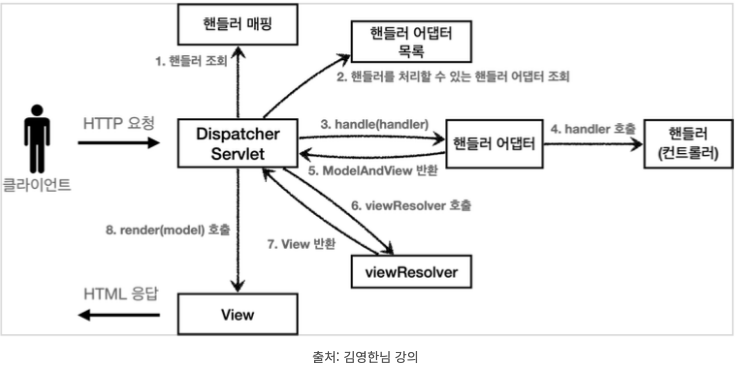
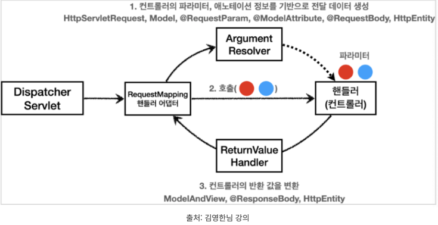
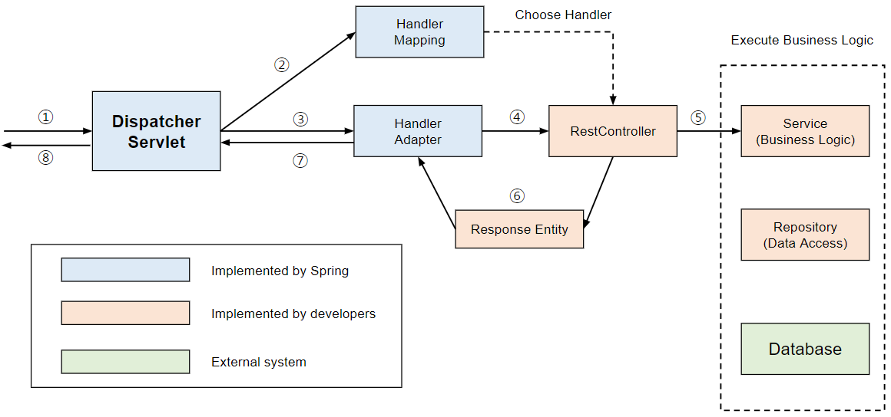
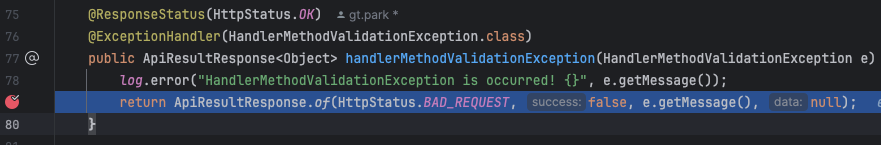
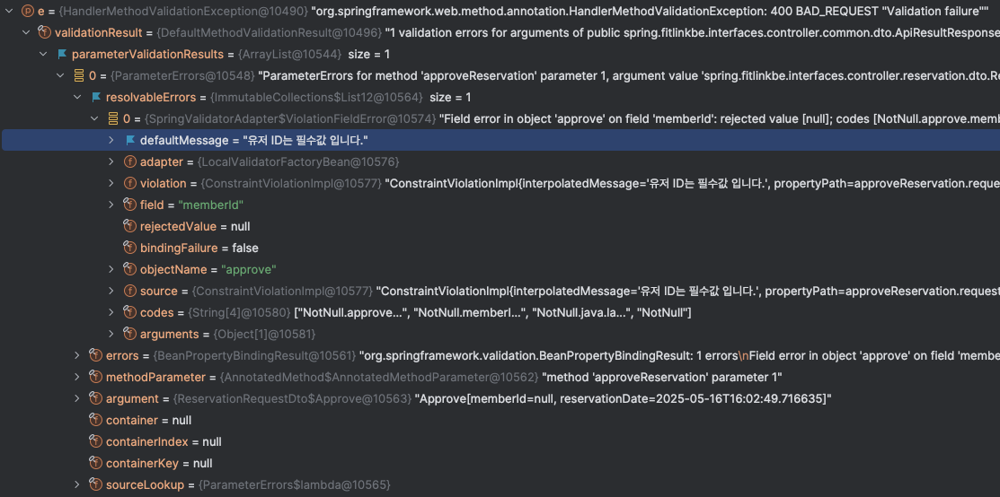

## 8-1. 알림 발송 트랜잭션 분리

### 8-1-1. 문제

기존에 알림 발송 로직은 다음과 같이 구성되어 있었습니다.

```java
@Service
@Transactional(readOnly = true)
@RequiredArgsConstructor
public class NotificationService {
  private final NotificationStrategyHandler strategyHandler;
  ...

  @Transactional
  public <T extends NotificationRequest> void sendNotification(T request) {
      // 1. DB 저장
      Notification notification = strategyHandler.handle(request);
      notificationRepository.save(notification);
      // 2. push 알림 전송
      pushNotificationClient.pushNotification(token, title, content);
  }
}
```

이 로직은 정상적으로 동작하지만 다음과 같은 문제점이 있습니다.

- 비즈니스 계층과 인프라 계층의 시스템이 **강하게 결합되어 있습니다.**

따라서 시스템의 복잡도가 올라갈 뿐만 아니라 만약에 push 알림 전송 도중에 에러가 발생한다면 위에 알림 저장 로직도 **롤백이 되게 됩니다.**

하나의 트랜잭션 내에서 ‘모두 성공하거나, 모두 실패해야한다.’ 라는 점에서는 맞는 로직이지만, 외부 시스템에 의해서 DB 로직이 실패하는건 **핵심로직이 부가로직에 오염된 것처럼 보였습니다.**

### 8-1-2. 원인

생각해보면, 위 로직은 **단일책임원칙을** 위배하는 것처럼 보입니다.

**“하나의 모듈은 하나의 책임만 가져아 한다.”**

위 로직을 살펴보면

- DB에 알림 정보 저장 **(핵심 로직)**
- psuh 알림 전송 **(부가 로직)**

두가지 **책임을** 가지고 있습니다.

따라서 로직을 분리할 필요가 있어 보입니다.

### 8-1-3. 해결방법

**EDA**를 도입하여 위 문제를 해결하려고 하였습니다.

### **EDA란?**

- **Event-Driven Architecture (이벤트 기반 아키텍처)**
- 시스템 구성 요소들이 **이벤트(event)** 를 중심으로 **생성 → 전달 → 처리**되는 구조
- 이벤트: 시스템 내에서 발생한 어떤 **상태 변화나 행동 (예: 주문 완료, 결제 성공)**

이것을 도입하면 시스템간의 복잡도를 낮춰 **느슨한 결합**과 **확장성**에 유리하게 됩니다.

그리고 EDA를 도입하면 이벤트 단위로 책임이 분산되므로, 자연스럽게 관심사의 분리가 가능하게 됩니다.

스프링에서 지원하는 `ApplicationEventPublisher` 와 `EventListener` 를 활용하면 충분히 이벤트 드리븐하게 위 상황을 해결할 수 있을 것 같습니다.

### 8-1-4. 적용

바뀐 로직을 보면

```java
@Service
@Transactional(readOnly = true)
@RequiredArgsConstructor
public class NotificationService {
    private final NotificationRepository notificationRepository;
    private final NotificationStrategyHandler strategyHandler;
    private final PushNotificationClient pushNotificationClient;
    private final ApplicationEventPublisher publisher;

   ...

  @Transactional
  public <T extends NotificationRequest> void sendNotification(T request) {
      // 1. DB 저장
      Notification notification = strategyHandler.handle(request);
      notificationRepository.save(notification);
      // 2. push 알림 전송 이벤트로 전달
      publisher.publishEvent(PushEvent.builder()
              .pushToken(request.getPushToken())
              .name(notification.getName())
              .content(notification.getContent())
              .build());
  }
    
   public void pushNotification(String token, String title, String content) {
      pushNotificationClient.pushNotification(token, title, content);
  }
 ... 
}
```

이벤트가 발행되면, 이벤트를 수신하는 곳에서 그 이벤트를 처리합니다.

```java
@Component
@RequiredArgsConstructor
public class NotificationEventListener {

    private final NotificationService notificationService;

    @Async
    @TransactionalEventListener(phase = TransactionPhase.AFTER_COMMIT)
    public void onPushEvent(PushEvent event) {
        notificationService.pushNotification(event.pushToken(), event.name(), event.content());
    }
}
```

여기서 `@TransactionalEventListener(phase = TransactionPhase.AFTER_COMMIT)` 이 옵션을 통해, **DB 로직이 commit이 된 후**, 이벤트를 호출하게 됩니다.

따라서 `pushNotificationClient.pushNotification(token, title, content);` 이 로직이 실패하더라도, 핵심 로직은 보호 받게 됩니다.

다만, 알림 전송이 실패하는 경우, **retry 로직으로 알림 전송을 보장해주는 로직을 보완해야할 것 같습니다.**

## 8-2. @Valid가 동작하지 않음
<br />

### 8-2-1. 문제

테스트코드를 작성 후, 테스트를 하던 중 이상한 점을 발견하였습니다.

```java
@RoleCheck(allowedRoles = {UserRole.TRAINER})
@PostMapping("/{reservationId}/approve")
public ApiResultResponse<ReservationResponseDto.Success> approveReservation(@PathVariable("reservationId")
                                                                            @NotNull(message = "예약 ID는 필수값입니다.")
                                                                            Long reservationId,
                                                                            @RequestBody @Valid
                                                                            ReservationRequestDto.Approve
                                                                                    request,
                                                                            @Login SecurityUser user
) {
    Reservation result = reservationFacade.approveReservation(request.toCriteria(reservationId), user);

    return ApiResultResponse.ok(ReservationResponseDto.Success.of(result));

}
```

```java
public class ReservationRequestDto {
	...
	
	@Builder(toBuilder = true)
	public record Approve(@NotNull(message = "유저 ID는 필수값 입니다.") Long memberId,
	                      @NotNull(message = "요청 날짜는 비어있을 수 없습니다.")
	                      @FutureOrPresent(message = "현재 날짜보다 이전일 수 없습니다.")
	                      LocalDateTime reservationDate) {
	    public ReservationCriteria.Approve toCriteria(Long reservationId) {
	
	        return ReservationCriteria.Approve.builder()
	                .reservationId(reservationId)
	                .memberId(memberId)
	                .reservationDate(reservationDate)
	                .build();
	    }
	}
	
 ...
}

```

예외는 공통으로 `@RestControllerAdvice` 를 작성하여 처리하였습니다.

```java
@RestControllerAdvice
@Slf4j(topic = "ExceptionLogger")
public class ApiControllerAdvice {

    @ResponseStatus(HttpStatus.OK)
    @ExceptionHandler(CustomException.class)
    public ApiResultResponse<Object> handlerCustomException(CustomException e) {
        log.error("CustomException is occurred! {}", e.getMessage());
        return ApiResultResponse.of(HttpStatus.valueOf(e.getStatus()), false, e.getMessage(), null);
    }
    
    @ResponseStatus(HttpStatus.OK)
    @ExceptionHandler(HandlerMethodValidationException.class)
    public ApiResultResponse<Object> handlerMethodValidationException(HandlerMethodValidationException e) {
        log.error("HandlerMethodValidationException is occurred! {}", e.getMessage());
        return ApiResultResponse.of(HttpStatus.BAD_REQUEST, false, e.getMessage(), null);
    }
    ...
    
}
```

```java
@WebMvcTest(ReservationController.class)
class ReservationControllerTest {

    @Autowired
    private MockMvc mockMvc;

    @Autowired
    private ObjectMapper objectMapper;

    @MockitoBean
    private ReservationFacade reservationFacade;

    @MockitoBean
    private AuthTokenProvider authTokenProvider;

    @MockitoBean
    private PersonalDetailRepository personalDetailRepository;

    @MockitoBean
    private LoginMemberArgumentResolver loginMemberArgumentResolver;

...

@Nested
@DisplayName("예약 승인 Controller TEST")
class ApproveReservationControllerTest {
    
    ...

    @Test
    @DisplayName("트레이너의 예약 실패 - 멤버 ID 부재")
    void approveReservationWithNoMemberId() throws Exception {
        //given
        ReservationRequestDto.Approve request = ReservationRequestDto.Approve.builder()
                .reservationDate(LocalDateTime.now().plusSeconds(2))
                .build();

        Long reservationId = 1L;

        Reservation result = Reservation.builder()
                .reservationId(1L)
                .status(RESERVATION_APPROVED)
                .build();

        PersonalDetail personalDetail = PersonalDetail.builder()
                .personalDetailId(1L)
                .name("멤버1")
                .memberId(1L)
                .trainerId(null)
                .build();

        SecurityUser user = new SecurityUser(personalDetail);

        String accessToken = getAccessToken(personalDetail);

        when(reservationFacade.approveReservation(any(ReservationCriteria.Approve.class),
                any(SecurityUser.class))).thenReturn(result);

        //when & then
        mockMvc.perform(post("/v1/reservations/%s/approve".formatted(reservationId))
                        .header("Authorization", "Bearer " + accessToken)
                        .with(oauth2Login().oauth2User(user))
                        .with(csrf())
                        .content(objectMapper.writeValueAsString(request))
                        .contentType(MediaType.APPLICATION_JSON))
                .andDo(print())
                .andExpect(status().isOk())
                .andExpect(jsonPath("$.status").value(400))
                .andExpect(jsonPath("$.success").value(false))
                .andExpect(jsonPath("$.msg").value("유저 ID는 필수값 입니다."))
                .andExpect(jsonPath("$.data").isEmpty());
      }
  }
  
  ...
}

```

위의 테스트 코드를 돌려보면 다음과 같은 결과가 나옵니다.

```java
Resolved Exception:
             Type = org.springframework.web.method.annotation.HandlerMethodValidationException
...

JSON path "$.msg"
Expected :유저 ID는 필수값 입니다.
Actual   :400 BAD_REQUEST "Validation failure"
```

제가 기대하는 건 `‘유저 ID는 필수값 입니다.’` 라는 메세지인데 `400 BAD_REQUEST "Validation failure"` 가 실제로 출력이 되었습니다.

로그를 보면 `HandlerMethodValidationException` 가 발생하는걸 알 수 있고, `@RestControllerAdvice` 에서 해당 `Exception`을 잡아서 처리를 해줬습니다.

`@Valid` 을 통해 `@RequestBody` 를 유효성 검증을 했는데, 왜 원하는 메세지가 출력이 되질 않는지 이해가 되지 않았습니다.

### 8-2-2. 원인

### **기존의 Spring의 @Valid 어노테이션이 동작하는 과정**





스프링에서 Dispatcher Servlet은 **RequestMapping 핸들러 어댑터**를 통해 클라이언트로부터 들어오는 요청을 처리합니다. 유효성 검증을 위한 Validator를 미리 등록해두고, 요청이 들어왔을 때 **ArgumentResolver**를 호출해서 `@RequestParam, @RequestBody, @ModelAttribute` 등 들어오는 모든 필드를 검증하게 됩니다.

중요한 점은 `@RequestParam, @RequestBody`에 대한 검증을 SpringBoot3.2 이전 버전에서는 ArgumentResolver 하나가 **모두 위임 받는다는 것입니다**.

따라서 `@NotNull, @Blank, @Size` 와 같은 Constraint 어노테이션을 parameter 혹은 body에 붙여주기만 하면 필드 유효성 검증이 이루어졌습니다.

### **SpringBoot3 버전에서 @RequestBody에 대한 @Vaild 유효성 검증**

스프링 부트3(엄밀히는 스프링 6.1)부터 Spring MVC와 WebFlux에서 유효성 검사를 위한`@Constraint` 관련 애노테이션을 **기본적으로 지원하도록 개선되었습니다.**



기존에 처리 과정과 동일하게 `ArgumentResolver`들이 모두 동작하고, 컨트롤러의 메서드 호출이 준비되었을 때 유효성 검사가 진행됩니다. 스프링은 이를 **`MethodValidator`** 라고 부릅니다.

### 새로운 유효성 검사 기능(MethodValidator) 사용법

스프링의 `MethodValidator` 관련 기능을 활용하기 위해서는 다음의 조건들이 충족되면 됩니다.

1. 컨트롤러에 @Validated를 통한 AOP 기반 검증이 존재하지 않음
2. LocalValidatorFactoryBean와 같은 jakarta.validation.Validator 타입의 빈이 등록됨
3. 메서드 파라미터에 유효성 검증 애노테이션이 붙어있음

따라서 스프링 부트 3.2 이상 이라면  `@Valid` 또는 `@Validated`를 붙여줄 필요 없이 기본적인 유효성 검증이 동작하게 됩니다.

이때부터 `HandlerMethodValidationException` 가 추가가 되었습니다.

이 사실은 스프링 공식 문서에도 확인해 볼 수 있습니다.

> Spring MVC has built-in [validation](https://docs.spring.io/spring-framework/reference/core/validation/validator.html) for `@RequestMapping` methods, including [Java Bean Validation](https://docs.spring.io/spring-framework/reference/core/validation/beanvalidation.html). Validation may be applied at one of two levels:
>
>
> 1. [@ModelAttribute](https://docs.spring.io/spring-framework/reference/web/webmvc/mvc-controller/ann-methods/modelattrib-method-args.html), [@RequestBody](https://docs.spring.io/spring-framework/reference/web/webmvc/mvc-controller/ann-methods/requestbody.html), and [@RequestPart](https://docs.spring.io/spring-framework/reference/web/webmvc/mvc-controller/ann-methods/multipart-forms.html) argument resolvers validate a method argument individually if the method parameter is annotated with Jakarta `@Valid` or Spring’s `@Validated`, *AND* there is no `Errors` or `BindingResult` parameter immediately after, *AND* method validation is not needed (to be discussed next). The exception raised in this case is `MethodArgumentNotValidException`.
> 2. When `@Constraint` annotations such as `@Min`, `@NotBlank` and others are declared directly on method parameters, or on the method (for the return value), then method validation must be applied, and that supersedes validation at the method argument level because method validation covers both method parameter constraints and nested constraints via `@Valid`. The exception raised in this case is **`HandlerMethodValidationException`**.
>
<br />

`HandlerMethodValidationException` 의 유효성 검증 과정을 자세히 살펴보면

```java
@SuppressWarnings("serial")
public class HandlerMethodValidationException extends ResponseStatusException implements MethodValidationResult {

	private final MethodValidationResult validationResult;

	private final Predicate<MethodParameter> modelAttributePredicate;

	private final Predicate<MethodParameter> requestParamPredicate;

	public HandlerMethodValidationException(MethodValidationResult validationResult) {
		this(validationResult,
				param -> param.hasParameterAnnotation(ModelAttribute.class),
				param -> param.hasParameterAnnotation(RequestParam.class));
	}
```

`HandlerMethodValidationException`의 생성자를 보면 `@ModelAttribute`와 `@RequestParam`에 대한 유효성 검증 처리만을 전달하고 있습니다.

반면, `@RequestBody`나 `@PathVariable` 등에 대한 유효성 검증은 **제외되어 있습니다.**

### 8-2-3. 해결방법

`HandlerMethodValidationException` 에서 더이상 `@RequestBody` 에 대해서 유효성 검증을 담당하고 있지 않기 때문에 직접 메세지를 핸들링 해주기로 하였습니다.

<br />
이 방식은 스프링 공식문서에서도 권장하는 방식입니다.

> **For further custom handling of method validation errors, you can extend `ResponseEntityExceptionHandler` or use an `@ExceptionHandler` method in a controller or in a `@ControllerAdvice`, and handle `HandlerMethodValidationException` directly.** The exception contains a list of `ParameterValidationResult`s that group validation errors by method parameter. You can either iterate over those, or provide a visitor with callback methods by controller method parameter type:
>

<br />

그래서 디버깅을 통해 위 내용이 사실인지 확인해 보기로 하였습니다.

테스트 코드를 디버깅 모드로 돌려서 breakPoint를 에러를 핸들링 하는곳에 잡아두고,



디버깅에 찍히는 값을 확인해 보면



`ParameterValidationResults -> getResolvableErrors -> getDefaultMessage` 에 들어가보면 제가 설정한 메세지를 확인할 수 있었습니다.

### 8-2-4. 적용

눈으로 확인했으니, 다음 예외가 발생했을 때 제 메세지를 반환해주는 작업만 해주면 될 것 같습니다.

```java
public class MessageConvertUtils {

    /**
     * DTO에서 값을 검증할 때 메시지를 설정했을 경우 그 메시지만 나오게 변환
     *
     * @return 내가 설정한 메시지
     */
    public static String getErrorCustomMessage(Exception e) {

        if (e instanceof HandlerMethodValidationException exception) {
            return exception.getParameterValidationResults().stream()  // getValidationResults() 사용
                    .map(ParameterValidationResult::getResolvableErrors)
                    .flatMap(Collection::stream)
                    .map(MessageSourceResolvable::getDefaultMessage)
                    .collect(Collectors.collectingAndThen(Collectors.joining(", "),
                            msg -> msg.isEmpty() ? "보내는 파라미터를 다시 확인해주세요." : msg));
        }
        
        return e.getMessage();
    }
}

```

다음 유틸 함수를 적용하면,

```java
@RestControllerAdvice
@Slf4j(topic = "ExceptionLogger")
public class ApiControllerAdvice {

    @ResponseStatus(HttpStatus.OK)
    @ExceptionHandler(CustomException.class)
    public ApiResultResponse<Object> handlerCustomException(CustomException e) {
        log.error("CustomException is occurred! {}", e.getMessage());
        return ApiResultResponse.of(HttpStatus.valueOf(e.getStatus()), false, e.getMessage(), null);
    }
    
    @ResponseStatus(HttpStatus.OK)
    @ExceptionHandler(HandlerMethodValidationException.class)
    public ApiResultResponse<Object> handlerMethodValidationException(HandlerMethodValidationException e) {
        log.error("HandlerMethodValidationException is occurred! {}", e.getMessage());
        return ApiResultResponse.of(HttpStatus.BAD_REQUEST, false, getErrorCustomMessage(e), null);
    }
    ...
    
}
```

그리고 다시 테스트 코드를 돌려보면 결과는

```java
MockHttpServletResponse:
           Status = 200
    Error message = null
          Headers = [Content-Type:"application/json", X-Content-Type-Options:"nosniff", X-XSS-Protection:"0", Cache-Control:"no-cache, no-store, max-age=0, must-revalidate", Pragma:"no-cache", Expires:"0", X-Frame-Options:"DENY"]
     Content type = application/json
             Body = {"status":400,"success":false,"msg":"유저 ID는 필수값 입니다.","data":null}
    Forwarded URL = null
   Redirected URL = null
          Cookies = []
```

설정한 메세지가 정상적으로 출력되는 것을 볼 수 있습니다.
